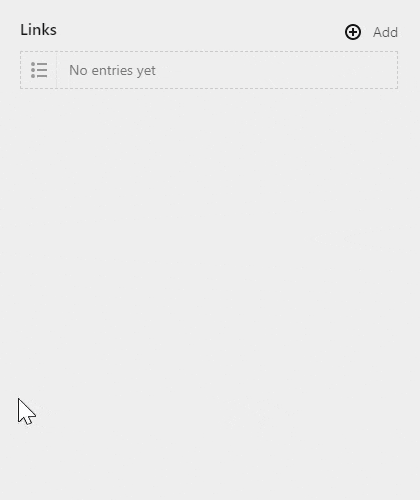

Show and pick a free Font Awesome icon. 

# Install
## Download Zip file

Copy plugin folder into `site/plugins`

## Composer
Run `composer require rasteiner/k3-awesome-picker`.

# Usage
Add an `icon` field to your blueprint. You can also choose to filter the available icons by declaring the wanted styles: `brands` (Logos), `solid` (filled icons), `regular` (outlined icons)

In your template you will get the class names for the chosen icon. 

## Example

Blueprint:

```yaml
fields:
  myIcon:
    label: My Icon
    type: icon
    styles: 
      - brands 
      - solid
```

Template:

```php
<script src="https://kit.fontawesome.com/<yourkit>.js" crossorigin="anonymous"></script>

This is the chosen icon: <i class="<?= $page->icon() ?>"></i>
```

## Config options

Under the `rasteiner.awesome-picker` namespace, you'll have access to the following options:

| option | default | description |
| --- | --- | --- |
| `'css-url'` | `'https://kit-free.fontawesome.com/releases/latest/css/free.min.css'` | Used in the panel, the URL to the font awesome CSS |
| `'meta-source'` | `'github'` | File path, or function returning the file path, to the "icons.yml" file containing all metadata of the icons. The default setting of 'github' downloads the metadata from github on first usage, then it stores the file on the server |
| `'sprites-folder'` | `false` | Useful when using the SVG setup ([see below](#SVG-setup)). Path, or function returning the path, to the sprites folder |
| `'default-styles'` | `["solid", "regular", "brands", "light", "duotone"]` | Array or string for which styles should be available when the `styles` setting in your blueprint isn't used |
| `'loaded-styles'` | `["solid", "regular", "brands", "light", "duotone"]` | Array or string for which styles should ever be available for use |


## SVG setup

If you prefer having your icons embedded in your page and use them via SVG links, this plugin offers you a way to manage this, but you need to prepare it for the use case. 

1. **Download your icons**  
    Font Awesome gives you the option to download their icons. Download the "web" version from here: https://fontawesome.com/download. Unzip the file and upload it to your server. 
2. **Configure the plugin**  
    The plugin needs to know 3 things:
    1. The URL to the CSS file with all classes you intend to use (this is used only for the panel, you'll find them in the css folder you downloaded)
    2. The file path to the metadata of your icons (you'll find this in the "metadata" folder, look for an "icons.yml" file)
    3. The file path to the folder containing the sprite sheets (this is the "sprites" folder)
  
    Here's an example config:
    ```php
    <?php

    return [
        'rasteiner.awesome-picker' => [
            'css-url' => function() {
                return url('assets/fontawesome-free-5.15.1-web/css/all.min.css');
            },
            'meta-source' => 'assets/fontawesome-free-5.15.1-web/metadata/icons.yml',
            'sprites-folder' => 'assets/fontawesome-free-5.15.1-web/sprites',
        ]
    ];
    ```
    You can assign all those config options either a string, or a function that returns a string. 

3. **Adapt the templates**  
    Linked svg icons need 2 steps to work:
    1. Use the icons, via the `<use xlink:href="#icon-id">` tag
    2. Embed all used icons in the page, via many `<symbol id="icon-id">` tags

    This plugin offers you some functions to help you do this, it tracks which icons have been used, and then injects all used items as symbols. To do this, you'll use the following methods:
    1. the `$field->toIcon()` field method. This gives you an "Icon" object
    2. the `$icon->use($attrs)` method of the Icon object, this gives you an svg element containing a corresponding `<use>` tag. This method optionally lets you specify the attributes given to the `<svg>` tag.
    3. the `$site->iconSymbols()` method which generates an svg element containing all previously used icons as `<symbol>` elements. 

    Here's a short example template:
    ```php
    <!-- in your page -->
    <?= $page->myIcon()->toIcon()->use(['class' => 'my-icon-css-class']) ?>
    
    <!-- bottom of your page -->
    <?= $site->iconSymbols() ?>
    ```

    This will output something like this:

    ```html
    <!-- in your page -->
    <svg class="my-icon-css-class"><use xlink:href="#fas-cloud-sun"></use></svg>
    
    <!-- bottom of your page -->
    <svg xmlns="http://www.w3.org/2000/svg" width="0" height="0" style="display: none;">
      <symbol id="fas-cloud-sun" viewBox="0 0 640 512">
        <path d="..." />
      </symbol>
    </svg>
    ```

    > **Notice**: you need to call `$site->iconSymbols()` **after** all `$icon->use()` calls. So either put the symbols at the end of the page, or output buffer your page.
